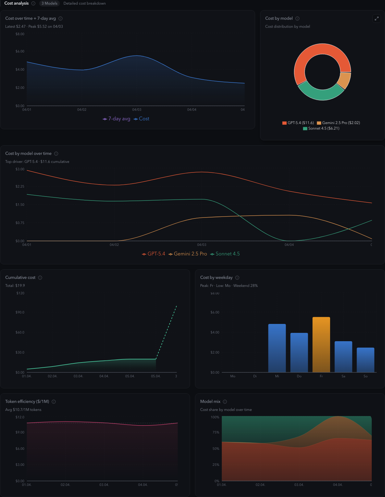
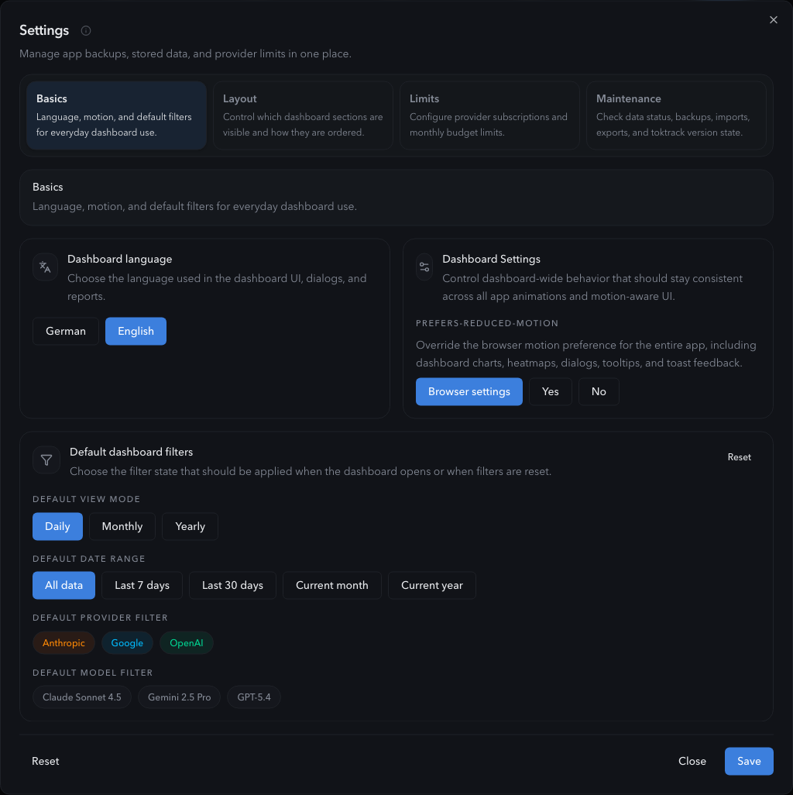

# TTDash

[](https://github.com/roastcodes/ttdash/actions/workflows/ci.yml)
[](https://www.npmjs.com/package/@roastcodes/ttdash)
[](LICENSE)
[](https://github.com/roastcodes/ttdash/blob/main/package.json)

`TTDash` is a local-first dashboard and CLI for `toktrack` usage data. It runs entirely on your machine, turns raw usage exports into charts and operational summaries, and keeps your stored data, settings, and imports on local disk instead of a hosted backend.

`TTDash` is built around the usage data provided by [`toktrack`](https://github.com/mag123c/toktrack). Thanks to [mag123c](https://github.com/mag123c) for creating and maintaining the data source this dashboard builds on.

## Keep Claude Code History

Claude Code cleans up old sessions after 30 days by default. If you want long-term cost history in `toktrack` and `TTDash`, raise or effectively disable that cleanup in `~/.claude/settings.json`:

```json
{
  "cleanupPeriodDays": 9999999999
}
```


## Why TTDash

- Local-first by default: no cloud backend, no remote database, no analytics
- Fast to try: `npx` and `bunx` work without a global install
- Built for daily usage review, cost tracking, and model/provider breakdowns
- Works with `toktrack` exports and legacy `ccusage` JSON
- Can auto-import local `toktrack` data and run in the background

## Dashboard At A Glance

Deeper cost and model analysis:



Settings, local backups, and saved defaults:



## Quick Start

Requirements:

- Node.js `20+`
- A modern browser on the same machine
- Typst CLI only if you want PDF export

Run `TTDash` directly from the npm registry:

```bash
npx --yes @roastcodes/ttdash@latest
```

Or with Bun:

```bash
bunx @roastcodes/ttdash@latest
```

Smoke-check the published CLI without starting the dashboard:

```bash
npx --yes @roastcodes/ttdash@latest --help
bunx @roastcodes/ttdash@latest --help
```

For a persistent global install:

```bash
npm install -g @roastcodes/ttdash
ttdash
```

```bash
bun add -g @roastcodes/ttdash
ttdash
```

## First Run

Start the app:

```bash
ttdash
```

`TTDash` starts a local server, opens the dashboard in your browser, and automatically retries on the next free port if `3000` is already in use.

Then either:

1. Click `Auto-Import` to load local `toktrack` data
2. Upload a `toktrack` JSON file manually
3. Upload a legacy `ccusage` export
4. Open `Settings` to export or import local backups

The auto-import path prefers:

1. local `toktrack`
2. `bunx toktrack@2.5.0`
3. `npx --yes toktrack@2.5.0`

## Common Commands

Quick examples:

Run on a specific port:

```bash
ttdash --port 3010
```

Disable browser auto-open:

```bash
ttdash --no-open
```

Import local data immediately on startup:

```bash
ttdash --auto-load
```

Start in the background:

```bash
ttdash --background
```

Stop a running background instance:

```bash
ttdash stop
```

Combine flags when needed:

```bash
ttdash --background --port 3010 --auto-load
ttdash --background --no-open
```

Environment-variable equivalents:

```bash
PORT=3010 ttdash
NO_OPEN_BROWSER=1 ttdash
HOST=127.0.0.1 ttdash
```

## CLI Reference

Usage:

```bash
ttdash [options]
ttdash stop
```

Options:

| Option              | Description                                  |
| ------------------- | -------------------------------------------- |
| `-p, --port <port>` | Set the start port                           |
| `-h, --help`        | Show CLI help                                |
| `-no, --no-open`    | Disable browser auto-open                    |
| `-al, --auto-load`  | Run local auto-import immediately on startup |
| `-b, --background`  | Start TTDash as a background process         |

Commands:

| Command       | Description                                                                                                             |
| ------------- | ----------------------------------------------------------------------------------------------------------------------- |
| `ttdash stop` | Stop one or more running background instances. If multiple instances are running, TTDash prompts for which one to stop. |

Environment variables:

| Variable                | Description                                               |
| ----------------------- | --------------------------------------------------------- |
| `PORT`                  | Override the start port                                   |
| `NO_OPEN_BROWSER=1`     | Disable browser auto-open                                 |
| `HOST`                  | Override the bind host, for example `HOST=0.0.0.0 ttdash` |
| `TTDASH_ALLOW_REMOTE=1` | Explicitly allow binding to a non-loopback host           |

Binding to a non-loopback host such as `0.0.0.0` exposes the local dashboard API to your network, including destructive routes for local data and settings resets. TTDash now refuses that bind unless you also set `TTDASH_ALLOW_REMOTE=1`. Only use this on trusted networks.

Example:

```bash
TTDASH_ALLOW_REMOTE=1 HOST=0.0.0.0 ttdash
```

## Features

- Provider and model filtering across OpenAI, Anthropic, Google, and other imported providers
- KPI sections for overall usage, today, and current month
- Cost charts, cumulative projection, forecast, token mix, model mix, heatmap, and weekday analysis
- Drill-down modal for per-day details
- CSV export and PDF export
- Command palette, keyboard shortcuts, and responsive layout
- Settings-backed defaults, section visibility, and local backups

## Local Storage and Privacy

`TTDash` is designed to stay local:

- No cloud backend
- No remote database
- No third-party fonts, analytics, or runtime tracking
- Imported usage data is stored on your machine
- Settings such as language, theme, provider limits, filters, and layout are stored on your machine

Platform paths:

- macOS: `~/Library/Application Support/TTDash/`
- Windows: `%LOCALAPPDATA%\\TTDash\\` for data and `%APPDATA%\\TTDash\\` for settings
- Linux: `~/.local/share/ttdash/` for data and `~/.config/ttdash/` for settings

## Backups

The `Settings` dialog can export and import:

- app settings backups
- stored usage data backups

Data-backup import is conservative by design:

- missing days are added
- identical days are skipped
- conflicting existing days stay local and are reported instead of being overwritten silently

If you want to fully replace the current dataset with a fresh `toktrack` JSON, keep using the normal upload action in the header.

## Troubleshooting

### `ttdash` not found after install

Make sure your global package manager bin directory is in `PATH`.

For Bun:

```bash
echo $PATH
ls -la ~/.bun/bin/ttdash
```

### Port already in use

`TTDash` automatically retries on the next port. You can also force one:

```bash
PORT=3010 ttdash
```

### Auto-import cannot find `toktrack`

Install `toktrack` locally or ensure `bunx` / `npx` can execute it in the same terminal environment where you run `ttdash`.

### PDF export fails

PDF export requires the Typst CLI to be installed locally.

macOS:

```bash
brew install typst
```

Other platforms:

- install Typst from `https://typst.app/`
- make sure `typst --version` works in the same terminal where you run `ttdash`

## Installation From Source

Clone the repository and install locally:

macOS / Linux:

```bash
sh install.sh
ttdash
```

Windows:

```bat
install.bat
ttdash
```

Manual source install:

```bash
npm install
npm run build
npm install -g .
ttdash
```

Or with Bun:

```bash
bun install
bun run build
bun add -g "file:$(pwd)"
ttdash
```

## Development

Run the app locally from the repo:

```bash
npm install
npm run dev
node server.js
```

- Vite dev server: `http://localhost:5173`
- API / production server: `http://localhost:3000`

Build the production bundle:

```bash
npm run build
```

`npm run build` is the gated build and runs `format:check` and `lint` before bundling. If you only want the Vite production bundle, use:

```bash
npm run build:app
```

Run automated checks:

```bash
npm run verify
```

For the full release-style local gate without re-running unit tests or rebuilding twice, use:

```bash
npm run verify:full
```

If you want to run the steps individually, use:

```bash
npm run check:deps
npm run test:architecture
npm run test:unit:coverage
npm run test:e2e
```

To inspect the slowest suites and test cases after a Vitest run:

```bash
npm run test:timings
```

The Playwright suite uses its own isolated local app directory. If port `3015` is already occupied locally, run it on another isolated port:

```bash
PLAYWRIGHT_TEST_PORT=3016 npm run test:e2e
```

Refresh the README screenshots:

```bash
npm run docs:screenshots
```

## Release and Project Docs

- Contributor guide: [`CONTRIBUTING.md`](CONTRIBUTING.md)
- Release guide: [`RELEASING.md`](RELEASING.md)
- Architecture rules: [`docs/architecture.md`](docs/architecture.md)
- Test architecture: [`docs/testing.md`](docs/testing.md)
- Security policy: [`SECURITY.md`](SECURITY.md)
- Code of conduct: [`CODE_OF_CONDUCT.md`](CODE_OF_CONDUCT.md)

## Status

GitHub Actions now runs formatting checks, ESLint, `tsc --noEmit`, unit/integration coverage, the production bundle, packaged-artifact verification, and Playwright smoke tests for pull requests and pushes to `main`.

## License

MIT. See [`LICENSE`](LICENSE).
