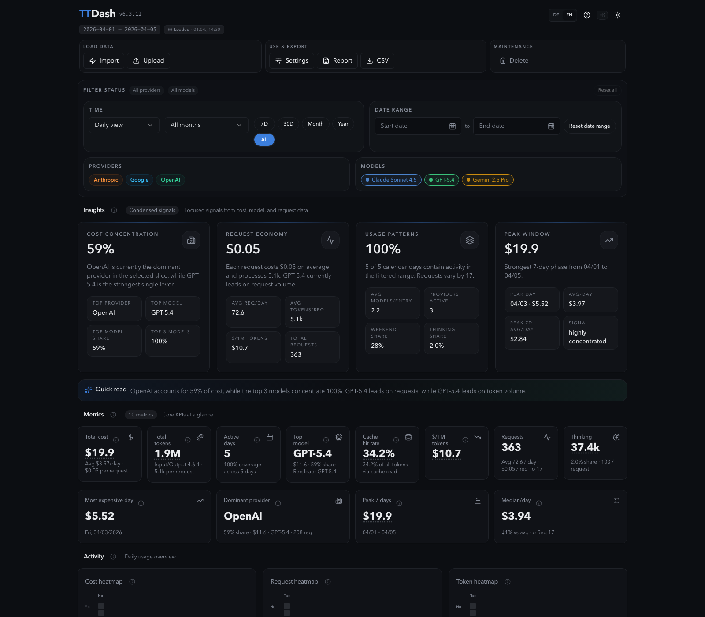

# TTDash

[](https://github.com/roastcodes/ttdash/actions/workflows/ci.yml)
[](https://roastcodes.github.io/ttdash/)
[](https://www.npmjs.com/package/@roastcodes/ttdash)
[](LICENSE)
[](package.json)

TTDash is a local-first dashboard and CLI for
[`toktrack`](https://github.com/mag123c/toktrack) usage data. Explore costs, tokens, requests,
models, providers, forecasts, and exports without sending your usage data to a hosted TTDash
backend.

[](https://roastcodes.github.io/ttdash/guides/dashboard/)

## Quick start

Run the latest release without a global installation:

```bash
npx --yes @roastcodes/ttdash@latest
```

Or use Bun:

```bash
bunx @roastcodes/ttdash@latest
```

TTDash starts on `http://127.0.0.1:3000`, selects a nearby free port when necessary, and
opens your browser. You can then auto-import current `toktrack` data, upload supported JSON, or
restore a TTDash usage backup.

For a global installation:

```bash
npm install --global @roastcodes/ttdash
ttdash
```

## What you get

- Cost, token, request, cache, model, provider, weekday, and calendar analysis
- Daily, monthly, yearly, preset, and custom date filters
- Forecasts, comparisons, anomalies, cache ROI, limits, and concentration insights
- `toktrack` and legacy daily JSON imports plus TTDash backup restore
- CSV export and localized PDF reports when [Typst](https://typst.app/) is installed
- Local-first storage, configurable dashboards, themes, keyboard navigation, and Docker support

TTDash builds on the data produced by `toktrack`. Thanks to
[mag123c](https://github.com/mag123c) for creating and maintaining it.

## Documentation

The documentation site is the source of truth for installation, usage, deployment, and
contributor guidance:

| Topic                         | Guide                                                                                                                                                   |
| ----------------------------- | ------------------------------------------------------------------------------------------------------------------------------------------------------- |
| Install and first run         | [Getting started](https://roastcodes.github.io/ttdash/getting-started/)                                                                                 |
| Import usage data             | [Importing data](https://roastcodes.github.io/ttdash/getting-started/importing-data/)                                                                   |
| Use dashboards and filters    | [Dashboard guide](https://roastcodes.github.io/ttdash/guides/dashboard/)                                                                                |
| Configure the CLI and storage | [Configuration reference](https://roastcodes.github.io/ttdash/deploying/configuration/)                                                                 |
| Deploy securely               | [Remote access](https://roastcodes.github.io/ttdash/deploying/remote-access/) and [Docker](https://roastcodes.github.io/ttdash/deploying/docker/)       |
| Integrate with the server     | [HTTP API](https://roastcodes.github.io/ttdash/reference/http-api/)                                                                                     |
| Work on TTDash                | [Architecture](https://roastcodes.github.io/ttdash/contributing/architecture/) and [testing](https://roastcodes.github.io/ttdash/contributing/testing/) |

Start at **[roastcodes.github.io/ttdash](https://roastcodes.github.io/ttdash/)**. Every page has
an edit link, and the site is built and checked from the versioned source in
[`docs-site/src/content/docs`](docs-site/src/content/docs).

## Requirements

- Node.js 20 or newer for npm/npx installations
- A modern browser
- npm or Bun when TTDash needs to run `toktrack` for auto-import
- Typst only for PDF export
- Docker with Compose v2 only for container deployments

## Remote access

TTDash binds to loopback by default. For a non-loopback bind, deliberately enable remote access
and provide a token of at least 24 characters:

```bash
export TTDASH_REMOTE_TOKEN="$(openssl rand -hex 32)"
TTDASH_ALLOW_REMOTE=1 HOST=0.0.0.0 ttdash
```

API clients can use either supported authentication header:

```bash
curl -H "Authorization: Bearer $TTDASH_REMOTE_TOKEN" http://192.0.2.10:3000/api/usage
curl -H "X-TTDash-Remote-Token: $TTDASH_REMOTE_TOKEN" http://192.0.2.10:3000/api/usage
```

Use remote HTTP only on a trusted LAN, VPN, or SSH tunnel. Public hostnames require an HTTPS
reverse proxy; do not send the token or session over public HTTP. Read the
[remote-access guide](https://roastcodes.github.io/ttdash/deploying/remote-access/) and
[security policy](SECURITY.md) before exposing TTDash beyond loopback.

## Development

Install dependencies and run the Vite frontend:

```bash
npm install
npm run dev
```

Run `node server.js` in a second terminal for the local API. Before opening a pull request, run:

```bash
npm run verify:full
npm run docs:install
npm run docs:verify
npm run test:docs:e2e
```

The documentation workspace requires Node.js 22.12 or newer; CI uses Node.js 24. See
[`CONTRIBUTING.md`](CONTRIBUTING.md) for the full workflow.

## Project links

- [Documentation](https://roastcodes.github.io/ttdash/)
- [Releases](https://github.com/roastcodes/ttdash/releases)
- [Contributing](CONTRIBUTING.md)
- [Security policy](SECURITY.md)
- [Code of conduct](CODE_OF_CONDUCT.md)

## License

TTDash is available under the [MIT License](LICENSE).
